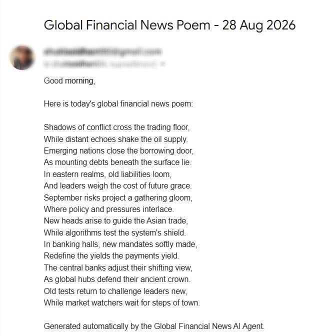

# Global Financial News AI Agent

An automated AI-powered financial news workflow built with **Google Apps Script, Google News RSS, Gemini API, and Gmail**.

The system collects current global financial news, sends the selected articles to Gemini for analysis, generates a concise **16-line financial news poem**, validates the output, and automatically distributes it by email.

## Architecture

```text
Google News RSS
      |
      v
Google Apps Script
      |
      v
Financial News Extraction
      |
      v
Gemini API
      |
      v
16-Line Financial Summary
      |
      v
Output Cleaning & Validation
      |
      v
Automated Email Delivery
```

## Key Features

- Collects global financial-market news through Google News RSS.
- Extracts article titles, publication dates, and sources.
- Integrates Google's Gemini API for AI-based synthesis.
- Uses prompt constraints to request exactly 16 lines.
- Extracts only the model output from the Gemini response.
- Removes accidental numbering, bullets, quotation marks, and empty lines.
- Validates that the final output contains exactly 16 lines.
- Sends the generated result automatically through Gmail.
- Supports scheduled execution through Google Apps Script time-driven triggers.
- Keeps the Gemini API key outside the source code using Script Properties.
- Includes a separate Gemini connectivity test.

## Technologies Used

- Google Apps Script (JavaScript)
- Google News RSS
- Gemini API
- Gmail / MailApp
- RSS/XML parsing
- HTTP requests and JSON
- Google Apps Script Properties
- Time-driven automation triggers

## How It Works

### 1. News Collection

`fetchFinancialNews()` requests a Google News RSS feed focused on global financial markets, stocks, economy, business, and finance. It parses the RSS XML and collects up to 15 articles.

### 2. AI Processing

The article information is assembled into a structured prompt and sent to Gemini through the API.

The prompt instructs the model to produce exactly 16 meaningful lines and return only the poem without metadata, numbering, explanations, or technical information.

### 3. Response Extraction

The Gemini Interactions API response can contain multiple steps. The script specifically searches for the `model_output` step and extracts its text content so the complete API JSON is not used as the final result.

### 4. Output Validation

The generated text is cleaned by removing empty lines, accidental numbering, bullet symbols, and surrounding quotation marks.

The script then verifies that the final result contains **exactly 16 lines**. If validation fails, the workflow stops rather than sending an invalid result.

### 5. Email Automation

The validated poem is sent through Google Apps Script's `MailApp`.

A time-driven Apps Script trigger can execute the workflow automatically on a schedule.

## Security

The Gemini API key is **not stored in `Code.gs`**.

Create a Google Apps Script Script Property:

```text
GEMINI_API_KEY = your_api_key
```

Do not commit API keys, passwords, access tokens, or private credentials to GitHub.

## Setup

1. Create a Google Apps Script project.
2. Add `Code.gs`.
3. Add the `GEMINI_API_KEY` Script Property.
4. Configure the recipient email placeholders.
5. Run `testGemini()` to verify API connectivity.
6. Run `sendPoemEmail()` for a manual end-to-end test.
7. Create a time-driven trigger for `sendPoemEmail()` for scheduled execution.

## Sample Output

The agent automatically delivers the generated financial-news poem by email.



## Skills Demonstrated

- API Integration
- AI/LLM Integration
- Prompt Engineering
- Workflow Automation
- Financial News Analysis
- Data Extraction
- RSS/XML Parsing
- JSON Processing
- HTTP Requests
- Error Handling
- Output Validation
- Scheduled Automation
- Email Automation
- Credential Management
- Debugging and Logging

## Future Improvements

- Financial-news ranking and relevance scoring
- Duplicate-news detection
- Topic classification
- Market-impact scoring
- Structured daily financial briefs
- Historical news storage
- Dashboard integration
- Additional financial data sources
- Multi-language summaries

## Disclaimer

This project is intended as an automation and learning project for financial-news monitoring. It does not provide investment advice or financial recommendations.
